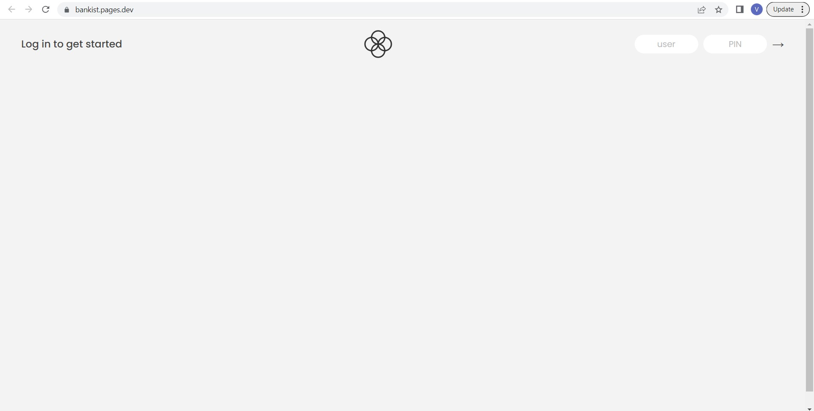
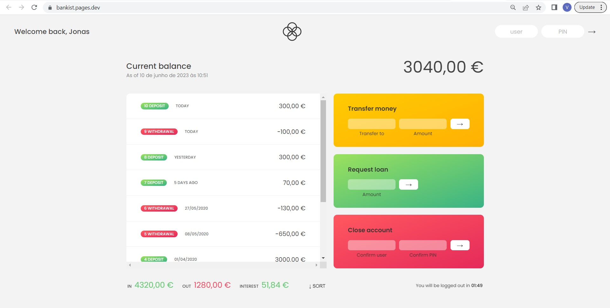

# Bankist
The Bankist is a fictional banking application built for practicing JavaScript concepts. It serves as a simplified demonstration of banking functionalities, including account balances, transfers, loans, and user authentication.

Bankist has below features:
- User Authentication: Users can log in to their accounts using their credentials, such as a username and pin.
- Account Overview: Users can view their account balances, transaction history.
- Money Transfers: Users can transfer money to other users' accounts.
- Loans: Users may have the option to apply for loans.
- Security Features: User is logged out from the app after a certain time period of inactivation

This website is built using the JavaScript programming language and is hosted on the Cloudflare platform.

 
 

 
 **Instructions**
 
To access the website, you can use the following login credentials: 
* username: js, pin: 1111
* username: jd, pin: 2222
* username: stw, pin: 3333
* username: ss, pin: 4444

Please note that the website does not provide the option for new users to create an account or register.
Also the loan amount must not exceed 10% of the maximum deposit value.
 
**Languages**

**URL**

https://bankist.pages.dev
